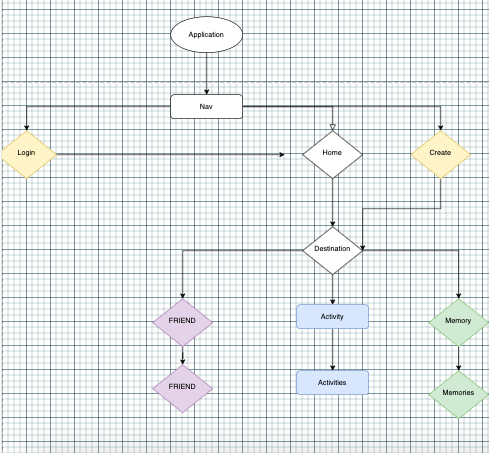
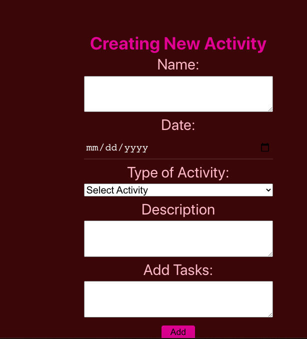
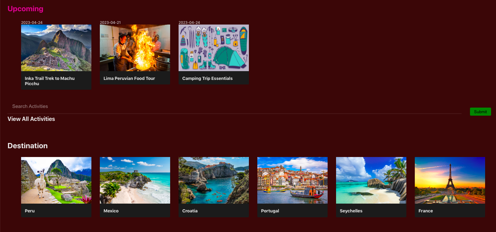

# Travel-Log
## Date 10/19/22
### By: Shondriane Mesa-Wise

[Github](https://github.com/shondriane)
[LinkedIn](https://www.linkedin.com/in/shondriane-mesa-wise/)

***

### ***Description***
The goal of the travel log is to:
Find, Track and Update Travel itinerary
Upload memorable moments.
***

### ***Technologies Used***

* HTML
* CSS
* Mongo
* Express
* React
* Node js

***

### ***Getting Started***
To get started, login to the app 
Create your destination location
Add/ remove items from your itinerary 
Upload photos 

A trello board used to keep track of development progress can be [viewed here](https://trello.com/b/zoNBYnKl/travel-log).

The project itself was deployed and can be [viewed here](https://shondriane-travel.herokuapp.com/).

### ***Photos***

***

### ***Credits***

Markdown Guide: ia.net
Mongodb : [mongodb.com]
Express: [expressjs.com/en/guide/routing.html]
React:[https://reactjs.org/]
NodeJs: [https://nodejs.org/en/]
DrawIo: [https://www.draw.io/]
Photo of Peru: [https://www.planetware.com/wpimages/2019/12/peru-in-pictures-best-places-to-photograph-machu-picchu-llama.jpg]
Photo of USA: [https://img-aws.ehowcdn.com/700x/www.onlyinyourstate.com/wp-content/uploads/2016/04/USA_Antelope-Canyon.jpg]
Photo of Portugal:[https://media.istockphoto.com/photos/porto-portugal-skyline-picture-id700954448?k=20&m=700954448&s=612x612&w=0&h=LpK9LeBmjascapuw1b7O24XPMpLcBF737-16_ABHh5E=]
Photo of Seychelles:[https://www.planetware.com/wpimages/2019/09/seychelles-in-pictures-most-beautiful-places-to-visit-anse-source-dargent-la-digue.jpg]
convert time: bobbyhadz.com

